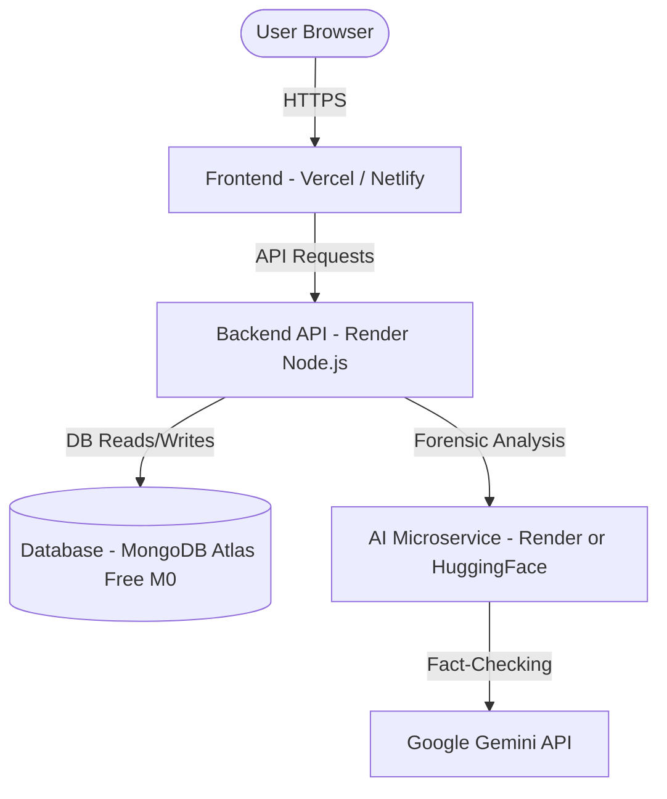

# TruthLens Free Cloud Hosting Guide 🚀

This guide explains how to host the complete **TruthLens** full-stack application **100% free** using modern cloud providers.

---

## Architecture Overview



---

## Step 1: Database Setup (MongoDB Atlas — Free Forever)

1. Sign up for free at [MongoDB Atlas](https://www.mongodb.com/cloud/atlas/register).
2. Click **Create a Deployment** and select the **M0 Free** cluster (512 MB storage).
3. Under **Security Quickstart**:
   - Create a **Username** and **Password** (save these for later).
   - Under **Network Access**, choose **Allow Access from Anywhere** (`0.0.0.0/0`).
4. Go to **Database** → **Connect** → **Drivers** (Node.js).
5. Copy your connection string:
   ```env
   mongodb+srv://<username>:<password>@cluster0.xxxxx.mongodb.net/truthlens?retryWrites=true&w=majority
   ```
   *(Replace `<username>` and `<password>` with your database credentials).*

---

## Step 2: Push Your Code to GitHub

If you haven't already pushed your TruthLens project to GitHub:

```bash
git add .
git commit -m "Configure production cloud hosting"
git branch -M main
git remote add origin https://github.com/YOUR_USERNAME/truthlens.git
git push -u origin main
```

---

## Step 3: Deploy AI Microservice (Render or Hugging Face)

### Option A: Render (Easiest)
1. Sign up at [Render.com](https://render.com/).
2. Click **New +** → **Web Service**.
3. Connect your GitHub repository.
4. Fill in the configuration:
   - **Name**: `truthlens-ai-service`
   - **Root Directory**: `ai-service`
   - **Environment**: `Python 3`
   - **Build Command**: `pip install -r requirements.txt`
   - **Start Command**: `python app.py`
   - **Plan**: `Free`
5. Under **Environment Variables**, add:
   - `GEMINI_API_KEY`: `your_gemini_api_key_here`
   - `PORT`: `8001`
6. Click **Deploy Web Service**.
7. Copy your AI Service URL once deployed (e.g., `https://truthlens-ai-service.onrender.com`).

---

## Step 4: Deploy Backend API Gateway (Render)

1. On [Render.com](https://render.com/), click **New +** → **Web Service**.
2. Connect the same GitHub repository.
3. Fill in the configuration:
   - **Name**: `truthlens-backend`
   - **Root Directory**: `backend`
   - **Environment**: `Node`
   - **Build Command**: `npm install`
   - **Start Command**: `npm start`
   - **Plan**: `Free`
4. Under **Environment Variables**, add:
   - `MONGODB_URI`: `your_mongodb_atlas_connection_string_from_step_1`
   - `JWT_SECRET`: `your_super_secret_jwt_key_random_string`
   - `AI_SERVICE_URL`: `https://truthlens-ai-service.onrender.com` *(from Step 3)*
   - `NODE_ENV`: `production`
5. Click **Deploy Web Service**.
6. Copy your Backend URL once deployed (e.g., `https://truthlens-backend.onrender.com`).

---

## Step 5: Deploy Frontend (Vercel — Instant Global CDN)

1. Sign up / log in to [Vercel](https://vercel.com/).
2. Click **Add New** → **Project**.
3. Import your `truthlens` GitHub repository.
4. Configure the project:
   - **Framework Preset**: `Vite`
   - **Root Directory**: Click **Edit** and choose `frontend`.
5. Under **Environment Variables**, add:
   - **Key**: `VITE_API_URL`
   - **Value**: `https://truthlens-backend.onrender.com/api` *(your backend URL from Step 4 with `/api` appended)*
6. Click **Deploy**.

Within 1–2 minutes, Vercel will give you your live production URL (e.g., `https://truthlens.vercel.app`)!

---

## Verification Checklist

- [x] Test registration and login with the password eye toggle.
- [x] Verify image deepfake forensics upload.
- [x] Verify news fact-checking and claim verification via Google Gemini.
- [x] Verify results save to history and render claims accurately.
